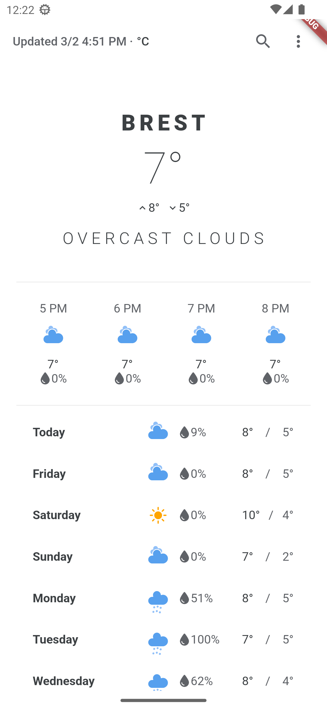
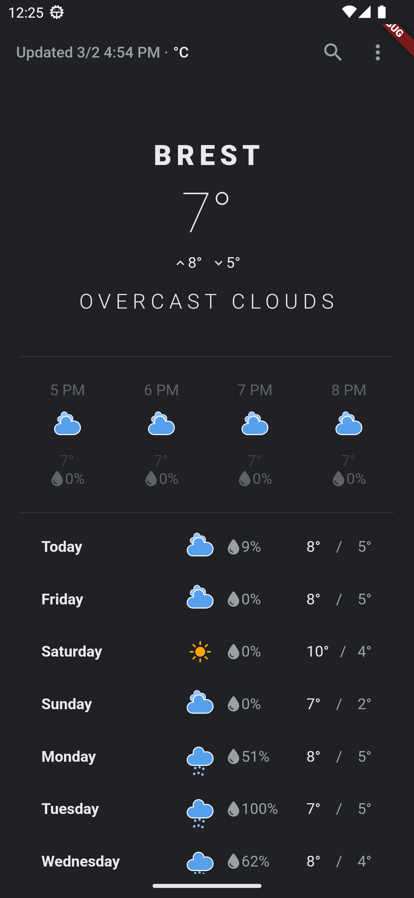

# Weather.

The Weather application, spelled out on clean architecture.

## Getting Started.

This project is a starting point for a Flutter application.

How do I start it up?

Terminal:

```
- gh repo clone pashabetenya/Nadvore.
```

IDE VS Code:

```
file, pubspec.yaml:

- flutter pub get packages.
```

```
file, main.dart:

- flutter run.
```

## The basic layers in a clean architecture.

## Presentation Layer:

```
This layer handles user input, and displays data on the screen. It should
not depend on other layers, and should provide an interface to interact with the user.
```

## Application Layer:

```
This layer contains the business logic, and manages all interactions between the layers. It depends
on the view layer, but is independent of the other layers.
```

## Domain Layer:

```
This layer contains the underlying business logic, and data models that are used by the application.
It should not depend on the lower layers,
and should be independent of frameworks and libraries.
```

## Infrastructure Layer:

```
This layer contains the implementation of infrastructure, such as databases, network services,
caching, etc. It depends on the domain layer, but should not depend on other layers.
```

### Packages, that were connected:

```
equatable: ^2.0.5;

riverpod: ^2.2.0;
shared_preferences: ^2.0.17;
url_launcher: ^6.1.9;

flutter_svg: ^1.1.6;
state_notifier: 0.7.2+1;

intl: ^0.17.0;

collection: 1.16.0;
http: 0.13.4.
```

### Review.

<table>
  <tr>
    <td>Weather - 1.</td>
    <td>Weather - 2.</td>
  </tr>
  <tr>
    <td></td>
    <td></td>
  </tr>
 </table>
